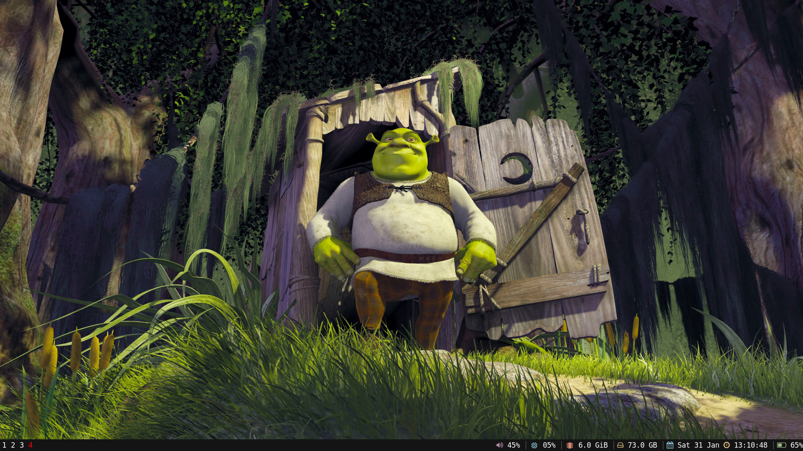

# i3wm Configuration

A clean, minimal i3 window manager configuration with a dark theme featuring red accents and a customized status bar.

## Screenshots

### Desktop


### Taskbar


## Features

### Visual Design
- **Dark Theme**: Black background (#141414) with red accents (#FF0000, #4E0707)
- **Custom Font**: DejaVu Sans Mono 13pt throughout the system
- **Minimalist Status Bar**: Clean, icon-based system information display
- **No Window Borders**: Streamlined window appearance with focused border highlighting

### System Monitoring
The i3status bar displays:
- Volume level with mute indicator
- CPU usage with real-time percentage
- Memory usage
- Available disk space
- Date and time with custom formatting
- Battery status with charging indicators and remaining time

## Utility Scripts

Located in `shortcut_scripts/`:

- **battery_allerts.sh**: Background service monitoring battery levels with notifications
- **performance**: Switch CPU governor to performance mode
- **powersaver**: Switch CPU governor to power-saving mode
- **whichPowerMode**: Check current power profile
- **folderParser**: Directory parsing utility
- **symbols.sh**: Special character/symbol input helper

## Configuration Files

```
i3wm_configurations/
├── i3/
│   └── config              # Main i3 configuration
├── i3status/
│   └── config              # Status bar configuration
├── terminator/
│   └── config              # Terminator terminal settings
├── shortcut_scripts/       # Utility scripts
└── images/                 # Screenshots
```


## License

This configuration is provided as-is for personal use and modification.

## Contributing

Feel free to fork this repository and customize it for your own setup. Pull requests for improvements are welcome.
